# ReubenAI Infrastructure Architecture - Post Cleanup

## Updated System Architecture (After Fund Memory Consolidation)

```mermaid
graph TB
    subgraph "Data Sources"
        WEB[Web Research Engine]
        DOC[Document Processor]
        MKT[Market Research Engine]
        FIN[Financial Engine]
        TEAM[Team Research Engine]
    end

    subgraph "Core AI Orchestration"
        REUBEN[Reuben Orchestrator]
        COMP[Comprehensive Analysis Engine]
        PIPELINE[Intelligent Pipeline Engine]
    end

    subgraph "Specialized AI Engines"
        DEAL[Enhanced Deal Analysis]
        MEMO[AI Memo Generator]
        IC[Investment Committee Analysis Enhancer]
        TERMS[Investment Terms Engine]
        MGMT[Management Assessment Engine]
        PRODUCT[Product IP Engine]
        RISK[Risk Mitigation Engine]
        EXIT[Exit Strategy Engine]
        THESIS[Thesis Alignment Engine]
        STRATEGY[Strategy Driven Analysis]
        MARKET[Market Intelligence Engine]
        RAG[RAG Calculation Engine]
    end

    subgraph "Fund Memory & Learning System"
        EFME[Enhanced Fund Memory Engine]
        style EFME fill:#2E8B57,stroke:#000,stroke-width:3px
        EFME_NOTE["🧠 UNIFIED FUND MEMORY<br/>- Legacy compatibility layer<br/>- Enhanced decision learning<br/>- Pattern discovery<br/>- Strategic evolution<br/>- Data controller integration"]
        style EFME_NOTE fill:#E8F5E8,stroke:#2E8B57,stroke-width:2px
    end

    subgraph "Data Governance & Security"
        DCM[Data Controller Monitor]
        style DCM fill:#FF6B6B,stroke:#000,stroke-width:3px
        DCM_NOTE["🛡️ AIR GAP PROTECTION<br/>- Fund isolation enforcement<br/>- Cross-fund data prevention<br/>- General training protection<br/>- Data lineage tracking"]
        style DCM_NOTE fill:#FFE8E8,stroke:#FF6B6B,stroke-width:2px
    end

    subgraph "Support Services"
        QUEUE[Analysis Queue Processor]
        PDF[Enhanced PDF Generator]
        IC_PDF[IC Memo PDF Exporter]
        SOURCING[Enhanced Deal Sourcing]
        UPDATE[Update Deal from Decision]
        FEEDBACK[Send Feedback Notification]
        IC_INVITE[Send IC Invitation]
        USER_INVITE[Send User Invitation]
        SUPPORT[Send Support Email]
    end

    %% Data flow connections
    WEB --> REUBEN
    DOC --> REUBEN
    MKT --> REUBEN
    FIN --> REUBEN
    TEAM --> REUBEN

    REUBEN --> COMP
    REUBEN --> DEAL
    REUBEN --> MEMO
    REUBEN --> IC
    REUBEN --> PIPELINE

    COMP --> EFME
    DEAL --> EFME
    MEMO --> EFME
    IC --> EFME
    PIPELINE --> EFME
    MARKET --> EFME

    %% All fund-specific data flows through data controller
    EFME -.->|Fund Data Protection| DCM
    DEAL -.->|Validation| DCM
    MEMO -.->|Validation| DCM
    IC -.->|Validation| DCM

    %% Cross-engine analysis flows
    TERMS --> REUBEN
    MGMT --> REUBEN
    PRODUCT --> REUBEN
    RISK --> REUBEN
    EXIT --> REUBEN
    THESIS --> REUBEN
    STRATEGY --> REUBEN
    RAG --> REUBEN

    %% Support service connections
    QUEUE --> DEAL
    PDF --> MEMO
    IC_PDF --> IC

    %% Annotations
    EFME --- EFME_NOTE
    DCM --- DCM_NOTE

    %% Remove old fund-memory-engine references
    %% All connections now go through enhanced-fund-memory-engine
```

## Key Infrastructure Improvements

### ✅ **Completed Cleanup Actions**

1. **🔧 Fund Memory Engine Consolidation**
   - ❌ Removed old `fund-memory-engine` 
   - ✅ Enhanced `enhanced-fund-memory-engine` with legacy compatibility
   - ✅ Updated 9 calling services to use unified engine
   - ✅ Preserved all existing API contracts (zero breaking changes)

2. **🗑️ Removed Unnecessary Guide Exporters**
   - ❌ Deleted `reubenai-complete-guide-exporter`
   - ❌ Deleted `reubenai-quick-start-exporter`
   - ❌ Deleted `reubenai-technical-guide-exporter`
   - ✅ Cleaned up `supabase/config.toml`

3. **🔄 Service Updates**
   - ✅ `DealDecisionService.ts` now uses enhanced engine only
   - ✅ All edge functions updated to new endpoint
   - ✅ Data controller monitor updated for new service name

### 🔒 **Enhanced Data Protection**

1. **Air Gap Enforcement**
   - Fund-specific data cannot reach general training
   - Cross-fund data sharing blocked
   - Data lineage tracking for all flows

2. **Fund Isolation**
   - Enhanced fund memory engine validates fund boundaries
   - Data controller monitor enforces isolation rules
   - No fund data leakage to Reuben orchestrator training

### 📊 **Current Engine Count: 24 Total**

**Core Engines (6):**
- Reuben Orchestrator
- Comprehensive Analysis Engine
- Enhanced Deal Analysis
- AI Memo Generator
- Investment Committee Analysis Enhancer
- Intelligent Pipeline Engine

**Specialized Engines (12):**
- Enhanced Fund Memory Engine (UNIFIED)
- Market Intelligence Engine
- Financial Engine
- Team Research Engine
- Investment Terms Engine
- Management Assessment Engine
- Product IP Engine
- Risk Mitigation Engine
- Exit Strategy Engine
- Thesis Alignment Engine
- Strategy Driven Analysis
- RAG Calculation Engine

**Support Services (6):**
- Data Controller Monitor
- Analysis Queue Processor
- Enhanced PDF Generator
- IC Memo PDF Exporter
- Enhanced Deal Sourcing
- Document Processor

### 🎯 **Next Priority Areas for Cleanup**

1. **Engine Communication Optimization**
   - Multiple engines calling Reuben Orchestrator
   - Potential for circular dependencies
   - Need service mesh or event-driven architecture

2. **Data Flow Simplification**
   - Complex inter-engine dependencies
   - Multiple pathways for similar data
   - Need standardized API contracts

3. **Service Consolidation Opportunities**
   - Similar functionality across engines
   - Potential for shared services
   - Microservice vs monolith trade-offs

### 🚀 **Performance & Reliability Gains**

- **Single Fund Memory Source**: No more data inconsistency
- **Reduced Edge Function Count**: 4 fewer functions to maintain
- **Simplified Data Flows**: Clear, auditable data pathways
- **Enhanced Security**: Stronger fund isolation and air gap protection
- **Better Monitoring**: Unified service topology for easier debugging

---

*Infrastructure cleaned up and consolidated. Ready for Phase 3 implementation with enhanced data governance and simplified service architecture.*