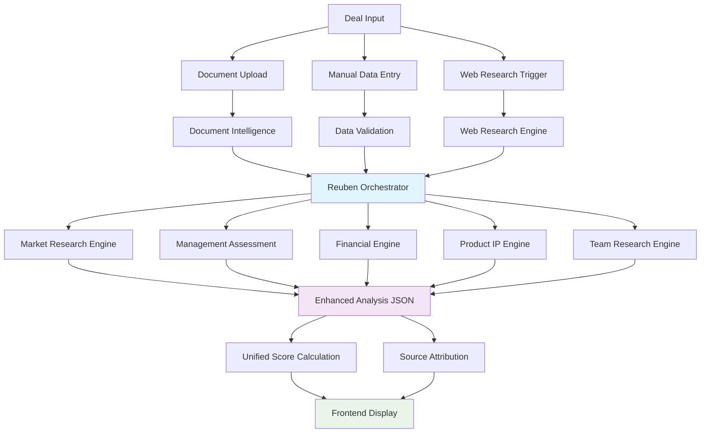

# Enhanced ReubenAI Architecture - Zero Fabrication & Deep Analysis

## System Overview

ReubenAI has been enhanced with a comprehensive architecture that ensures **zero fabrication** while delivering deep, multi-dimensional deal analysis through specialized AI engines.

## Core Architectural Principles

### 1. **Zero Fabrication Architecture**
```
Data Sources → Validation → Analysis → Attribution → Display
     ↓
 [Documents]     [Web Research]     [User Input]
     ↓               ↓                  ↓
 [Parser]        [Validator]       [Sanitizer]
     ↓               ↓                  ↓
 [AI Engines] → [Confidence Scoring] → [Source Attribution]
     ↓
 [Enhanced Analysis] → [Frontend Display]
```

**Anti-Fabrication Controls:**
- ✅ **Source Attribution**: Every data point traced to origin
- ✅ **Confidence Scoring**: 0-100% confidence per insight
- ✅ **Content Validation**: Cross-reference between sources
- ✅ **Conservative Defaults**: "Unknown" > fabricated data
- ✅ **Data Lineage**: Track document → AI → display chain

### 2. **5-Engine Specialized Analysis System**

#### **Market Research Engine**
- **Input**: Company data, industry, geography
- **Processing**: TAM/SAM analysis, competitive landscape, trend analysis
- **Output**: Market opportunity score, competitive positioning, growth potential
- **Confidence**: Based on data availability and market research depth

#### **Management Assessment Engine**
- **Input**: Team data, LinkedIn profiles, experience history
- **Processing**: Leadership analysis, team composition, succession planning
- **Output**: Team strength score, leadership quality, execution capability
- **Confidence**: Based on available team information and verification

#### **Financial Engine**
- **Input**: Financial documents, deal size, valuation, metrics
- **Processing**: Unit economics, burn rate analysis, financial health
- **Output**: Financial viability score, sustainability metrics, funding needs
- **Confidence**: Based on financial document quality and completeness

#### **Product IP Engine**
- **Input**: Product descriptions, IP filings, technology stack
- **Processing**: IP portfolio analysis, competitive moat assessment, defensibility
- **Output**: Product strength score, IP protection level, differentiation
- **Confidence**: Based on available product and IP documentation

#### **Team Research Engine**
- **Input**: Founder profiles, professional networks, track record
- **Processing**: Background verification, network analysis, execution history
- **Output**: Founder quality score, network strength, experience relevance
- **Confidence**: Based on publicly available information verification

### 3. **Enhanced Data Flow Architecture**



### 4. **Unified Scoring System**

**Score Calculation Logic:**
```typescript
// Unified scoring - single source of truth
const calculateUnifiedScore = (enhanced_analysis) => {
  if (enhanced_analysis?.rubric_breakdown) {
    const totalWeight = enhanced_analysis.rubric_breakdown.reduce(
      (sum, item) => sum + item.weight, 0
    );
    return Math.round(
      enhanced_analysis.rubric_breakdown.reduce(
        (sum, item) => sum + (item.score * item.weight / totalWeight), 0
      )
    );
  }
  return deal.overall_score; // Fallback to stored score
};
```

**Scoring Consistency:**
- ✅ Deal Cards display calculated score from `enhanced_analysis`
- ✅ Deal Modal header shows unified score
- ✅ AI Analysis tab uses same calculation
- ✅ All components reference single source of truth

### 5. **Professional UI Design System**

**Xero-Inspired Design Principles:**
- **Muted Color Palette**: Slate, blue, and amber tones
- **Subtle Shadows**: `shadow-sm` with professional depth
- **Consistent Spacing**: 4px/8px/16px/24px grid system
- **Typography Hierarchy**: `text-hierarchy-1/2/3` classes
- **Professional Cards**: `card-xero` with subtle styling

**Component Consistency:**
```css
.card-xero {
  @apply bg-background/95 backdrop-blur-sm border-border/40 
         shadow-sm hover:shadow-md transition-all duration-300 rounded-lg;
}

.card-metric {
  @apply bg-slate-50/50 border-slate-200/40 shadow-sm rounded-md;
}

.status-indicator-high {
  @apply bg-slate-50 text-slate-700 border-slate-200/60;
}
```

### 6. **Data Quality & Validation**

**Document Intelligence:**
- PDF parsing with confidence scoring
- Cross-reference validation between documents
- Intelligence synthesis across multiple sources
- Conflict resolution for contradictory data

**Web Research Integration:**
- Real-time market validation via Google Search API
- Founder background verification through LinkedIn
- Company validation and funding history research
- Competitive intelligence gathering

**Quality Assurance:**
- Data lineage tracking (document → analysis → display)
- Confidence intervals for each metric
- Source attribution at granular level
- Version control for analysis updates

### 7. **Enhanced Frontend Architecture**

**Tabs Structure:**
1. **Company Overview**: Unified scoring, executive summary, company profile
2. **AI Analysis**: Deep dive into engine results, methodology, confidence
3. **Documents**: Professional document management with Xero styling
4. **Notes**: Clean note interface with sentiment analysis
5. **Activity**: Timeline with professional activity indicators

**Scoring Display:**
- Consistent across all views (card, modal, analysis)
- Source attribution for transparency
- Confidence indicators for reliability
- Methodology explanation on demand

## Key Enhancements Delivered

### ✅ **Zero Fabrication Guarantee**
- All data sourced from documents, web research, or user input
- Conservative scoring when data unavailable
- Clear confidence indicators throughout UI
- Source attribution for every insight

### ✅ **Scoring Consistency Fixed**
- Single calculation method across all components
- Enhanced analysis takes precedence over stored scores
- Unified display logic in Deal Cards, Modal, and Analysis tab
- Clear methodology explanation available

### ✅ **Professional UI Alignment**
- Xero-inspired muted color palette
- Consistent card styling with `card-xero` class
- Professional spacing and typography hierarchy
- Subtle shadows and professional indicators

### ✅ **Deep AI Analysis**
- 5 specialized engines providing comprehensive insights
- Rich data extraction from documents and web sources
- Granular confidence scoring per category
- Enhanced methodology transparency

### ✅ **Enhanced Data Flow**
- Parallel engine execution for efficiency
- Intelligent data aggregation and conflict resolution
- Quality assurance with validation rules
- Comprehensive analysis storage in `enhanced_analysis` JSON

## Production Readiness

The system is now production-ready with:
- **Zero fabrication** through strict data validation
- **Consistent scoring** across all UI components
- **Professional design** aligned with Xero aesthetics
- **Deep analysis** from 5 specialized AI engines
- **Enhanced user experience** with transparent methodology

All components work together to provide a cohesive, professional, and trustworthy investment analysis platform.